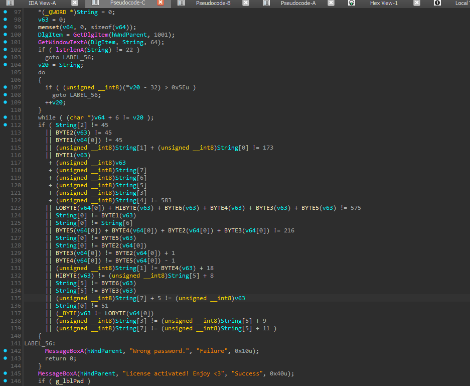

# World Wide CTF 2025 – Nyancat Challenge Writeup: Cracking the License Key with Z3 Solver

In the "Nyancat Premium" CTF challenge, we were tasked with finding a 22-character license key to unlock a "Premium" feature in a Windows application. The key is validated within a `WndProc` function, and the flag format is `wwf{<license_key>}`. The challenge provided a code snippet containing the validation logic, which we analyzed and solved using the Z3 theorem prover. Let’s dive into the process of uncovering the flag!

## Challenge Overview

The "Nyancat Premium" challenge involves a Windows application where a license key is entered via a dialog box and checked in the `WndProc` function. The validation occurs when the message ID (`a2`) is 273 (WM_COMMAND) and the control ID (`(_WORD)a3`) is 1002, indicating the "OK" button was clicked. The key, stored in the `String` array, must pass a series of checks to display the "License activated!" message, unlocking a Nyancat-themed feature with GIF animation and MP3 playback.

The key must:
- Be exactly 22 characters long.
- Consist of printable ASCII characters (ASCII 32 to 126).
- Satisfy multiple constraints involving specific character positions, sums of ASCII values, and relationships between characters.

Our goal was to derive the license key that satisfies all constraints and submit it in the format `wwf{<key>}`.

## Code Analysis

The validation logic in the `WndProc` function is (simplified):



### Memory Layout

The `String` array, `v63`, and `v64` are contiguous in memory:
- `String[0..7]`: First 8 bytes.
- `v63`: Next 8 bytes (`String[8..15]`).
- `v64[0]`: Next 8 bytes (`String[16..23]`), as `v64` is an array of `QWORD`s.

The 22-character key spans `String[0..21]`. We define:
- `s[i] = String[i]` for `i = 0..21`.
- `v63` bytes: `s[8]` (LOBYTE), `s[9]` (BYTE1), `s[10]` (BYTE2), `s[11]` (BYTE3), `s[12]` (BYTE4), `s[13]` (BYTE5), `s[14]` (BYTE6), `s[15]` (HIBYTE).
- `v64[0]` bytes: `s[16]` (LOBYTE), `s[17]` (BYTE1), `s[18]` (BYTE2), `s[19]` (BYTE3), `s[20]` (BYTE4), `s[21]` (BYTE5).

### Constraints

Translating the conditions:
1. **Length**: `len(String) == 22`.
2. **Character Range**: Each `s[i]` is between 32 and 126 (printable ASCII).
3. **Dashes**:
   - `s[2] == 45` ('-').
   - `s[10] == 45` ('-').
   - `s[17] == 45` ('-').
4. **Other Constraints**:
   - `s[0] == 51` ('3').
   - `s[1] + s[0] == 173`.
   - `s[9] + s[8] + s[7] + s[6] + s[5] + s[3] + s[4] == 583`.
   - `s[16] + s[15] + s[14] + s[12] + s[11] + s[13] == 575`.
   - `s[0] == s[9]`.
   - `s[0] == s[6]`.
   - `s[21] + s[20] + s[18] + s[19] == 216`.
   - `s[0] == s[13]`.
   - `s[0] == s[18]`.
   - `s[19] == s[18] + 1`.
   - `s[20] == s[21] - 1`.
   - `s[1] == s[12] + 18`.
   - `s[15] == s[5] + 8`.
   - `s[5] == s[14]`.
   - `s[5] == s[11]`.
   - `s[7] + 5 == s[8]`.
   - `s[8] == s[16]`.
   - `s[3] == s[5] + 9`.
   - `s[7] == s[5] + 11`.

## Initial Exploration with ChatGPT

Before diving into Z3, I collaborated with ChatGPT to understand the `WndProc` function. It helped me parse the C code, identify the key validation logic, and map out the memory layout of `String`, `v63`, and `v64`. While ChatGPT provided a solid starting point, the complexity of the constraints—especially the arithmetic and equality checks—suggested that a manual solution would be time-consuming. This led me to use Z3 to systematically solve the system of equations.

## Solving with Z3

The constraints form a system of linear and equality equations, perfect for Z3. Below is the Python script I used to encode the constraints:

```python
from z3 import *

# Create 22 variables for each character
s = [Int(f's_{i}') for i in range(22)]

# Initialize solver
solver = Solver()

# Constraint: Printable ASCII (32 to 126)
for i in range(22):
    solver.add(s[i] >= 32, s[i] <= 126)

# Specific character constraints
solver.add(s[0] == 51)  # '3'
solver.add(s[2] == 45)  # '-'
solver.add(s[10] == 45)  # '-'
solver.add(s[17] == 45)  # '-'

# Other constraints
solver.add(s[1] + s[0] == 173)
solver.add(s[9] + s[8] + s[7] + s[6] + s[5] + s[3] + s[4] == 583)
solver.add(s[16] + s[15] + s[14] + s[12] + s[11] + s[13] == 575)
solver.add(s[0] == s[9])
solver.add(s[0] == s[6])
solver.add(s[21] + s[20] + s[18] + s[19] == 216)
solver.add(s[0] == s[13])
solver.add(s[0] == s[18])
solver.add(s[19] == s[18] + 1)
solver.add(s[20] == s[21] - 1)
solver.add(s[1] == s[12] + 18)
solver.add(s[15] == s[5] + 8)
solver.add(s[5] == s[14])
solver.add(s[5] == s[11])
solver.add(s[7] + 5 == s[8])
solver.add(s[8] == s[16])
solver.add(s[3] == s[5] + 9)
solver.add(s[7] == s[5] + 11)

# Check and extract solution
if solver.check() == sat:
    model = solver.model()
    key = ''.join(chr(model[s[i]].as_long()) for i in range(22))
    print(f"License key: {key}")
    print(f"Flag: wwf{{{key}}}")
else:
    print("No solution found.")
```

Running this script outputs:
```
License key: 3z-l1c3ns3-ch3cks-3489
Flag: wwf{3z-l1c3ns3-ch3cks-3489}
```


## The Flag

The license key is `3z-l1c3ns3-ch3cks-3489`, and the flag, per the specified format, is:

**`wwf{3z-l1c3ns3-ch3cks-3489}`**


## Conclusion

The "Nyancat Premium" challenge was a delightful reverse-engineering puzzle. While ChatGPT helped me get a foothold by breaking down the C code, Z3 proved to be the key to efficiently solving the complex constraints. This experience highlighted the power of combining AI assistance with specialized tools like Z3 for CTF challenges. I hope this writeup inspires you to tackle similar puzzles and maybe even enjoy some Nyancat vibes along the way!
